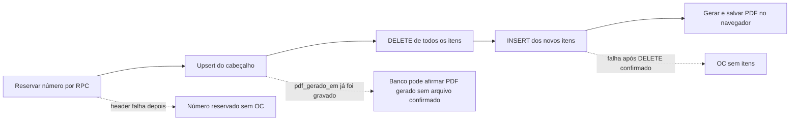

# Perícia técnica da estrutura de banco de dados — Ordem de Compra

**Empresa:** Campisi Engenharia  
**Sistema:** Central de Compras / Ordem de Compra  
**Data da perícia:** 10 de agosto de 2026  
**Escopo auditado:** branch `migracao-supabase`, commit `685f93e`  
**Método:** inspeção somente leitura do repositório, do painel Supabase disponível, da API anônima e dos testes locais  
**Responsável pelo parecer:** revisão técnica independente em nível sênior

---

## 1. Parecer executivo

> **Parecer: REPROVADO para a virada e para a emissão de OCs oficiais com dados reais no estado atual.**

A direção arquitetural é boa: o sistema separa os domínios `core` e `compras`, usa autenticação do Supabase, colocou a numeração concorrente em uma função PostgreSQL, mantém OCs canceladas no histórico e não expôs dados nas sondagens anônimas executadas. TypeScript, lint e os 69 testes existentes também passaram.

Esses pontos, porém, não compensam dois bloqueadores críticos:

1. **A gravação de uma OC não é atômica.** Cabeçalho, exclusão dos itens e reinserção são três operações independentes. Uma falha intermediária pode deixar uma OC numerada sem itens; gravações concorrentes podem apagar ou misturar alterações.
2. **O banco remoto não é reproduzível pelo repositório.** Não existe DDL SQL, pasta `supabase/`, migrations relacionais, políticas RLS, grants, triggers, views, funções ou tipos gerados versionados. Assim, não há como provar em CI que o banco implantado corresponde ao banco revisado, recriá-lo do zero ou executar rollback confiável.

Foram classificados **2 achados P0, 14 P1, 9 P2 e 4 P3**. Os P0 e os P1 ligados a atomicidade, idempotência, concorrência, histórico documental, permissões, paginação e recuperação precisam ser encerrados antes da virada.

### Ressalva importante

A branch `main` e `origin/main` ainda estavam no commit `147c468`, correspondente ao fluxo anterior em JSON/OneDrive. Portanto, os P0 deste relatório são **bloqueadores da migração Supabase**, não evidência de que a produção anterior já sofreu esses incidentes.

---

## 2. Quadro-resumo

| Severidade | Quantidade | Significado nesta perícia | Decisão |
|---|---:|---|---|
| P0 — Crítico | 2 | Pode corromper dados ou impede reconstrução e controle da base | Bloqueia virada |
| P1 — Alto | 14 | Pode causar perda financeira, documental, de autorização ou escala | Corrigir antes do piloto oficial |
| P2 — Médio | 9 | Gera inconsistência, degradação, falso sucesso ou fragilidade operacional | Planejar na estabilização |
| P3 — Baixo | 4 | Dívida técnica e manutenção | Corrigir oportunamente |

Nesta escala de perícia, a incapacidade de reconstruir o banco oficial a partir de uma fonte controlada é P0 por si só: ela impede restore confiável, homologação equivalente e rollback, mesmo que ainda não exista um incidente ativo.

### Cinco riscos que a diretoria precisa conhecer

| Risco | Exemplo concreto | Consequência empresarial |
|---|---|---|
| OC parcialmente gravada | Cabeçalho grava, itens são apagados e o novo insert falha | Documento numerado sem composição financeira |
| Repetição cria outra OC | Banco grava, PDF/reload falha e usuário clica novamente | Duplicidade e lacuna de numeração |
| PDF antigo muda | Endereço ou CNPJ do fornecedor é alterado e o PDF histórico é regenerado | Documento não reproduz o que foi efetivamente emitido |
| Usuários se sobrescrevem | A edita preços; B marca “Entregue” numa cópia antiga | B regrava os itens antigos e apaga a mudança de A |
| Histórico fica incompleto | A base ultrapassa o limite de linhas sem paginação | OCs novas podem não aparecer e totais ficam subcontados |

---

## 3. Escopo e evidências examinadas

### 3.1 Repositório

Foram examinados os serviços Supabase, stores, telas de cadastro e OC, gerador de PDF, domínio/Zod, migrações JSON, testes, workflow de deploy e documentação.

Arquivos de maior relevância:

- `src/services/supabase/dados.ts`
- `src/services/supabase/client.ts`
- `src/services/supabase/auth.ts`
- `src/services/supabase/sync.ts`
- `src/features/ordens-compra/NovaOcPage.tsx`
- `src/features/ordens-compra/HistoricoPage.tsx`
- `src/stores/useOcEditingStore.ts`
- `src/services/pdf/generateOcPdf.ts`
- `src/domain/schemas/data.schema.ts`
- `src/domain/compute.ts`
- `src/domain/normalize.ts`
- `src/services/ai/extractItems.ts`

Não foram encontrados no checkout nem no histórico Git alcançável:

- arquivos `.sql`;
- diretório `supabase/`;
- migrations PostgreSQL;
- políticas RLS e grants versionados;
- definições versionadas de views, triggers e funções;
- Edge Functions;
- tipos TypeScript gerados do banco.

### 3.2 Estrutura remota observada

A inspeção somente leitura do projeto Supabase `banco-principal` confirmou a separação entre os schemas `core` e `compras`.

As observações remotas desta seção foram feitas em **10/08/2026**, no fuso `America/Sao_Paulo`, sem registrar ou expor segredos. O horário exato e um export assinado do schema não foram capturados; por isso, o estado deve ser reextraído de forma automatizada e anexado ao pacote de go/no-go antes da virada.

| Schema | Objetos relevantes observados |
|---|---|
| `core` | `empresas`, `imoveis`, `intervencoes`, `fornecedores`, `perfis`, `documentos` |
| `compras` | `ecrs`, `emitentes`, `ordens_compra`, `oc_itens`, `numeracao`, `prestadores_servico`, `avaliacoes_prestadores` |
| Consumidos pelo cliente, mas não integralmente inspecionados | `materiais`, `oc_totais` |

Também foram observadas funções como:

- `core.papel_atual()`: busca o papel do usuário autenticado e exige perfil ativo;
- `compras.pode_emitir_oc()`: admite `admin`, `engenharia` e `financeiro`;
- `compras.proximo_numero_oc()`: usa `INSERT ... ON CONFLICT ... DO UPDATE` para incrementar a numeração no servidor.

A função de numeração individualmente segue uma boa direção. O problema está no fato de que **reservar o número e salvar a OC são transações diferentes**.

### 3.3 Verificações executadas

| Verificação | Resultado |
|---|---|
| `pnpm typecheck` | Passou |
| `pnpm lint` | Passou |
| `pnpm test -- --maxWorkers=1 --minWorkers=1` | 69 de 69 testes passaram |
| Sondagem anônima das tabelas conhecidas em `core` e `compras` | Todas negadas com HTTP 401 / PostgreSQL `42501` |
| Chave privilegiada rastreada no Git | Não encontrada |
| Estado inicial do worktree | Limpo |

Os 69 testes cobrem cálculo de domínio, normalização e migrações JSON. Não existem testes de integração Supabase, RLS, grants, concorrência, idempotência, rollback, paginação, Realtime, stores ou páginas.

A sonda anônima cobriu `core.perfis`, `core.fornecedores`, `core.intervencoes`, `core.imoveis`, `compras.ecrs`, `compras.materiais`, `compras.ordens_compra`, `compras.oc_itens`, `compras.emitentes`, `compras.numeracao`, `compras.prestadores_servico`, `compras.avaliacoes_prestadores` e `compras.oc_totais`. O resultado comprova apenas o cenário anônimo naquele instante; não substitui os testes autenticados por papel.

### 3.4 Limites da perícia

- A sessão do painel expirou ao abrir a área de políticas. Os corpos completos das policies, grants, índices, triggers, precisão dos `numeric`, `FORCE ROW LEVEL SECURITY` e publicação Realtime não puderam ser certificados.
- Não foi realizado nenhum write destrutivo ou teste de falha contra o banco remoto.
- O volume e a qualidade completos dos registros remotos não foram perfilados.
- A negação anônima é um bom sinal, mas **não prova** a matriz de autorização dos usuários autenticados.

---

## 4. Fluxo crítico atual

O fluxo correto deve ser uma única operação de negócio no servidor: validar, garantir idempotência, conferir versão, reservar número quando aplicável, salvar cabeçalho e itens, registrar evento e retornar o estado final. A persistência do PDF exato e de seu hash deve completar a emissão documental.

---

## 5. Achados P0 — críticos

### P0-01 — Salvamento destrutivo e não transacional da OC

**Evidência**

- `src/services/supabase/dados.ts:321-374`
  - upsert do cabeçalho: linhas 339–344;
  - exclusão de todos os itens: linhas 348–352;
  - reinserção: linhas 354–371.
- `src/features/ordens-compra/HistoricoPage.tsx:92-111` usa a mesma rotina para regenerar PDF e até para simples mudança de status.

**Falha**

São três requests e três pontos de commit, sem transação comum. Além disso, os IDs dos itens não são preservados na reinserção.

**Exemplo reproduzível pelo código**

`src/services/ai/extractItems.ts:109-119` aceita qualquer `ecr_id` numérico sem conferir o catálogo. Se entrar `ecr_id = 999` e existir uma FK no banco:

1. o número é reservado;
2. o cabeçalho grava;
3. os itens antigos são apagados;
4. o insert falha por FK;
5. sobra uma OC numerada sem itens.

Uma queda de rede entre as etapas 3 e 4 produz o mesmo efeito. Se a FK não existir, o resultado é um item órfão, o que é igualmente grave.

**Impacto**

- perda integral de itens;
- total financeiro incompatível com o documento;
- mistura de alterações concorrentes;
- destruição do histórico de identidade dos itens;
- efeito colateral desnecessário em mudança de status/PDF.

**Correção obrigatória**

Criar uma RPC transacional, por exemplo `compras.salvar_oc`, que valide e persista a operação completa. Revogar DML direto do cliente em `ordens_compra` e `oc_itens`, exceto o mínimo comprovadamente necessário. Mudanças de status e PDF devem ter comandos estreitos, sem regravar itens.

### P0-02 — Banco remoto sem fonte versionada e sem reconstrução comprovável

**Evidência**

O cliente depende de pelo menos oito consultas, uma RPC de numeração e uma view de totais, mas suas definições não existem neste checkout. O painel indicou “No repository connected”; isso prova somente que não havia integração Git demonstrada no painel naquele instante, não a inexistência absoluta de outro repositório ou fluxo CLI externo.

**Falha**

Não é possível revisar ou reproduzir com segurança:

- PKs, FKs, `UNIQUE`, `CHECK` e nulabilidade;
- índices e planos;
- RLS, grants e privilégios de funções;
- triggers de timestamps e auditoria;
- `proximo_numero_oc` e `oc_totais` completos;
- rollback e ambiente de homologação equivalente.

**Exemplo**

Uma policy é alterada manualmente no painel. O build e os 69 testes continuam verdes porque nenhum deles cria o banco ou testa RLS. Staging e produção passam a ter comportamentos diferentes sem qualquer diff no Git.

**Impacto**

Configuração manual vira fonte real da aplicação, sem trilha confiável, revisão, recuperação ou paridade entre ambientes.

**Correção obrigatória**

Versionar o projeto Supabase completo: migrations SQL, policies, grants, functions, views, triggers, seeds mínimos e tipos gerados. O CI deve recriar uma base vazia, aplicar tudo e executar testes estruturais e de RLS.

---

## 6. Achados P1 — altos

### P1-01 — Reserva e criação não são idempotentes

**Evidência:** `dados.ts:282-298` reserva o número; `NovaOcPage.tsx:337-419` salva em uma etapa posterior. “Salvar Rascunho” e “Emitir” usam flags independentes.

Se o banco confirmar a OC e depois o PDF ou o reload falhar, o editor permanece com estado local incompleto. Um retry pode reservar outro número e criar outra OC. Dois cliques em ações diferentes também podem iniciar dois fluxos.

O `upsert` usa conflito em `(ano, sequencial)`. Sem `request_id` e sem regra explícita de autoria/versão, uma repetição pode deixar lacuna ou sobrescrever um registro que não deveria ser o alvo.

**Recomendação:** `request_id` único por tentativa de negócio, retorno reaproveitável e reserva de número dentro da mesma transação que cria a OC. Repetir o mesmo `request_id` deve devolver a mesma OC e o mesmo número.

### P1-02 — Concorrência com “último save vence”

**Evidência:** `src/stores/useOcEditingStore.ts:33-80` mantém um clone local; `dados.ts:321-374` não envia `version` nem `expected_updated_at`. O Realtime atualiza o store global, mas não o editor aberto.

**Exemplo:** Ana altera o preço de um item. Bruno, com uma cópia antiga, apenas marca a OC como entregue. A rotina de Bruno regrava o cabeçalho e todos os itens antigos, apagando silenciosamente a alteração de Ana.

**Recomendação:** coluna `version` inteira, compare-and-swap no banco e erro de conflito explícito. Status deve ser alterado por RPC dedicada com `expected_version`.

### P1-03 — OC emitida não possui snapshot documental imutável

**Evidência:** `src/services/pdf/generateOcPdf.ts:101-111` resolve fornecedor, obra e emitente atuais; `HistoricoPage.tsx:92-100` regenera usando os cadastros atuais. A OC guarda principalmente FKs.

**Exemplo:** a OC 2026/008 foi emitida com um endereço. O fornecedor muda de endereço três meses depois. Ao regenerar a 2026/008, o PDF pode mostrar o endereço novo, não o documento efetivamente emitido.

`pdf_gerado_em` é preenchido com o relógio do navegador e salvo antes da geração efetiva do PDF (`NovaOcPage.tsx:373-380`). Não há URI canônica, hash, versão ou confirmação de armazenamento do arquivo.

**Recomendação:** snapshot da emissão, PDF canônico em Storage, SHA-256, versão, timestamp do servidor e vínculo imutável. Uma regeneração deve recuperar o artefato emitido; uma segunda via diferente precisa ser nova versão registrada.

### P1-04 — Trilha de auditoria e transições de status insuficientes

No modelo observado não apareceram `created_by`, `updated_by`, aprovador, motivo de cancelamento, versão ou tabela append-only de eventos. A tela permite cancelar inclusive uma OC entregue (`HistoricoPage.tsx:258-273`).

**Impacto:** não se reconstrói quem mudou preços, itens, status ou documento, nem por quê. Para compras empresariais e controles PBQP-H, isso reduz responsabilidade e poder de investigação.

**Recomendação:** `oc_eventos` append-only com `auth.uid()`, horário do servidor, evento, motivo, versão e before/after controlado; máquina de estados no banco. Exemplo de regra: `rascunho -> emitida -> entregue`, com cancelamento condicionado a motivo e permissão.

### P1-05 — `select('*')` solicita dados sensíveis desnecessários

**Evidência:** `dados.ts:68-83` usa `select('*')` em várias entidades e `imovel:imoveis(*)`. O schema remoto mostrou campos como:

- `core.imoveis`: latitude/longitude, cadastros, instalações CEMIG/DMAE, NIRF/INCRA/CCIR e dados de proprietário;
- `compras.emitentes`: `chave_pix`;
- `compras.prestadores_servico`: `chave_pix`, agência e conta bancária.

Os mapeadores descartam parte desses campos depois que a resposta chega ao navegador. Se os grants autenticados não restringirem colunas, informações não necessárias trafegam e ficam disponíveis ao cliente.

**Limite de confirmação:** os grants por coluna não foram certificados. Portanto, a exposição efetiva autenticada deve ser testada, mas a consulta excessiva no código está confirmada.

**Recomendação:** views estreitas por caso de uso, projeções explícitas e grants de coluna. A tela de OC não deve receber conta bancária ou identificadores patrimoniais que não usa.

### P1-06 — Carga global sem paginação pode esconder OCs

**Evidência:** `dados.ts:68-83` executa oito selects globais sem `range`, `limit`, `count` ou cursor. O Supabase limita, por padrão, o número de linhas retornadas pela Data API; a documentação recomenda paginação.

As OCs são ordenadas de forma crescente por ano e sequencial. Ao atingir o limite configurado, a tendência é manter as mais antigas e omitir justamente as novas.

**Exemplo:** com 1.001 OCs e limite de 1.000, a OC recém-criada pode não voltar no reload. Histórico, Dashboard e CSV passam a subcontar; o usuário pode acreditar que a gravação falhou e repetir a emissão.

**Recomendação:** consultas por tela, paginação/cursor, ordem decrescente para histórico, `count` quando necessário e detecção explícita de truncamento.

### P1-07 — Relação fornecedor × ECR é descartada com falso sucesso

**Evidência:** a UI permite marcar `ecrs_atende` (`FornecedorDrawer.tsx:65-71,171-203`), mas o loader força `ecrs_atende: []` (`dados.ts:120-137`) e o saver ignora a relação (`dados.ts:304-317`).

**Exemplo:** o usuário marca que um fornecedor atende determinado ECR, recebe sucesso e, após recarregar, a seleção desaparece.

**Recomendação:** tabela de junção `fornecedor_ecr`, PK composta `(fornecedor_id, ecr_id)`, FKs, políticas próprias e round-trip transacional.

### P1-08 — Invariantes de emissão e financeiras não são garantidas

**Evidência:** `NovaOcPage.tsx:365-369` exige apenas fornecedor, obra e pelo menos um item. Não exige emitente, condição, descrição/unidade, quantidade e preço positivos ou percentuais entre 0 e 100. `src/domain/schemas/data.schema.ts:136-169` usa números sem limites e nem é chamado no caminho Supabase.

`dados.ts:355-368` aceita zero e substitui descrição vazia por “Item sem descrição”.

**Exemplos possíveis se o banco também aceitar:**

- OC emitida com preço zero;
- desconto de 200%, produzindo total negativo;
- quantidade negativa;
- item sem unidade;
- ECR/material incompatíveis.

**Recomendação:** `CHECK` no PostgreSQL e validação equivalente no boundary do cliente. Regras críticas devem ser autoritativas no banco.

### P1-09 — Cliente sem tipos gerados e sem validação runtime

**Evidência:** `src/services/supabase/client.ts:25` cria o cliente sem generic `Database`; `carregarDados()` usa `Record<string, unknown>`, casts e coerções. Status, tipo de emitente, tipo de prestador e critérios entram sem `DataSchema.parse()`.

**Exemplo:** `status = 'aprovada'` vindo por schema drift atravessa um cast TypeScript e entra no estado como se fosse `StatusOc` válido.

**Recomendação:** tipos gerados a cada migration, validação Zod estrita na fronteira e falha observável/quarentena em vez de converter erro em valor válido.

### P1-10 — Isolamento de sessão e respostas assíncronas frágeis

**Evidência:** `App.tsx:128-191` limpa o DataStore no logout, mas não o `useOcEditingStore`. `sync.ts` aplica respostas sem token de geração, cancelamento ou confirmação do usuário atual.

**Exemplo:** usuário A deixa um rascunho aberto e sai. Usuário B entra no mesmo navegador; o rascunho de A pode continuar no editor. Uma carga iniciada por A também pode terminar depois do logout e repovoar o store durante a sessão de B.

**Recomendação:** zerar todos os stores no evento de auth; associar requests ao `user_id`/session generation; cancelar ou descartar respostas obsoletas; só abrir Realtime após perfil ativo confirmado.

### P1-11 — Configuração documental é fabricada no cliente

`dados.ts:92-117` fixa condições de pagamento e devolve endereço de cobrança e textos legais/fiscais/qualidade vazios. O PDF consome esses dados em `generateOcPdf.ts:242,325,343-347`.

**Impacto:** builds diferentes podem produzir termos diferentes para a mesma OC; não há versão, autoria ou vigência da configuração.

**Recomendação:** tabela de configuração por empresa, versão e período de vigência; snapshot da versão usada na emissão.

### P1-12 — Duas fontes de verdade para totais

`dados.ts:376-384` declara `oc_totais`, mas a função `totaisDaOc()` não possui consumidores. Tela, PDF, CSV e dashboard calculam em TypeScript com `computeOcTotals()`.

Não existe teste diferencial SQL × JavaScript nem política explícita de arredondamento por linha e no total.

**Exemplo:** quantidade fracionária, preço com centavos, IPI e desconto podem arredondar de modo diferente na view e no PDF.

**Recomendação:** uma fonte canônica e valores monetários com regra definida. Se ambos os motores permanecerem, criar testes diferenciais obrigatórios com casos-limite.

### P1-13 — Backup, restore e cutover não estão demonstrados

O painel mostrou o projeto no plano Free e “Last backup: No backups”. Não foi encontrado runbook versionado de exportação, restauração, freeze, rollback ou reconciliação da virada.

**Impacto:** uma migration incorreta ou erro operacional pode não ter ponto de recuperação comprovado.

**Recomendação:** antes de dados oficiais, escolher capacidade de backup compatível, produzir backup verificável e executar restore em ambiente separado. A virada precisa reconciliar contagens, somas, nulos, duplicatas, FKs, amostras, anexos e hashes quando aplicável.

### P1-14 — Autorização autenticada não possui teste de matriz

Pontos positivos confirmados:

- todas as sondagens anônimas foram negadas;
- `core.papel_atual()` considera apenas perfil ativo;
- `compras.pode_emitir_oc()` verifica o papel.

Lacunas:

- corpos de policies e grants não estão no Git;
- não há teste real de `sem perfil`, `inativo`, `leitura`, `financeiro`, `engenharia` e `admin`;
- as funções observadas como `SECURITY DEFINER` precisam de auditoria de owner, `search_path`, `EXECUTE` e exposição pela API;
- a documentação de rodada anterior admite papel financeiro sem teste real.

**Recomendação:** matriz automatizada de RLS/grants em banco efêmero e homologação, incluindo leitura de colunas sensíveis, chamadas de RPC e tentativas de bypass.

---

## 7. Achados P2 — médios

### P2-01 — Tempestade de consultas e renderização O(n)

Cada `recarregarDados()` executa oito consultas completas. Um save pode causar RPC, três writes, oito selects explícitos e outro reload disparado pelo próprio Realtime: aproximadamente vinte chamadas. `DataTable.tsx` renderiza todas as linhas sem paginação ou virtualização.

**Correção:** invalidar apenas recursos afetados, consultar por tela e paginar no servidor.

### P2-02 — Realtime parcial e indicador enganoso

`dados.ts:387-393` assina somente cabeçalhos de OC e fornecedores. Itens, obras/imóveis, emitentes, catálogo, prestadores e avaliações ficam de fora. Erros de reload são engolidos e a interface mostra “Banco conectado” de forma permanente.

**Correção:** estado real do canal, observabilidade de erro e estratégia de invalidação completa ou intencionalmente documentada.

### P2-03 — Permissão visual não acompanha a autorização

`HistoricoPage.tsx:256-274` mostra Editar, Duplicar, Entregue e Cancelar sem consultar o papel. Perfil `leitura` consegue iniciar a ação e só descobrir a negativa no banco.

Se a RLS estiver correta, é UX enganosa; se estiver permissiva, vira alteração indevida. A proteção real deve permanecer no banco, com a UI refletindo a mesma matriz.

### P2-04 — Rascunho existe somente em memória

Hooks de autosave e dirty guard não estão montados. Refresh, crash ou expiração da sessão perde o trabalho; Ctrl+S é interceptado sem `onSave` efetivo.

**Correção:** rascunho persistido e segregado por usuário ou aviso de trabalho sujo antes de sair.

### P2-05 — Parsing silencioso apaga ou zera dados

`normalize.ts:36-40` converte falha numérica em zero. O formato brasileiro `1.234,56` pode virar entrada inválida e acabar como `0`. `dados.ts:57-62` transforma documento inválido em `null`, e o cadastro só exige razão social.

**Correção:** parser brasileiro explícito, validação de CPF/CNPJ com checksum e erro bloqueante. Valor financeiro inválido nunca deve virar zero silenciosamente.

### P2-06 — Semântica de imóvel/obra precisa ser corrigida

`dados.ts:139-153` mapeia `cadastro_imobiliario` para `cei`, `conferido_por` para responsável e telefone do proprietário para telefone da obra. O PDF imprime o primeiro como CEI/CNO.

Cadastro imobiliário municipal não é necessariamente CEI/CNO; responsável pela conferência não é necessariamente responsável técnico; telefone do proprietário não é necessariamente contato de entrega.

**Correção:** validar o significado com o negócio e criar campos próprios como `cno`, `responsavel_obra` e `telefone_entrega`.

### P2-07 — Telefones extras podem ser perdidos

O domínio limita telefones a uma tupla de dois. A leitura pega apenas os dois primeiros e um save posterior pode sobrescrever o array remoto com esses dois.

**Correção:** remover o limite artificial ou impor/documentar a regra no banco e na UI.

### P2-08 — Versionamento do modelo JSON está divergente

- `CURRENT_SCHEMA_VERSION = 4` em `constants.ts`;
- Zod e pipeline já usam v5;
- seed não informa a versão;
- documentação ainda descreve v3;
- versão futura não é explicitamente rejeitada.

Embora esse seja o legado JSON, a divergência contamina migração, fixtures e confiança nos testes.

### P2-09 — Deploy e resíduos locais não têm garantia operacional

O workflow de deploy não injeta nem valida de forma demonstrável as variáveis Supabase antes do build. O cache legado `central-compras-cache-v2` também não possui limpeza de migração claramente acionada.

**Riscos:** build publicado que falha em runtime e dados antigos permanecendo no navegador compartilhado.

**Correção:** preflight obrigatório de configuração, smoke test pós-deploy e limpeza controlada/segregada de caches legados.

---

## 8. Achados P3 — baixos

### P3-01 — Documentação ainda declara JSON/OneDrive como fonte verdadeira

`docs/Readme.md` e `docs/Fluxo.md` descrevem o fluxo antigo, enquanto `App.tsx` declara Supabase. Isso aumenta a chance de operação e manutenção incorretas.

### P3-02 — Código legado passa falsa sensação de proteção

Hooks e stores do fluxo JSON continuam no projeto apesar de não protegerem o fluxo atual. Componentes sem uso também dificultam distinguir funcionalidade ativa de resíduo.

### P3-03 — Comparadores não retornam igualdade corretamente

Há comparadores que retornam `-1` mesmo quando os valores são iguais, podendo causar ordenação instável.

### P3-04 — `last_saved` não representa versão confirmada

O campo é preenchido com horário do navegador durante a leitura, não com commit ou versão reconhecida pelo banco. Não deve ser usado como prova de sincronização.

---

## 9. Avaliação da modelagem observada

| Área | O que está bem encaminhado | O que falta para nível empresarial |
|---|---|---|
| Separação de domínio | Schemas `core` e `compras` reduzem acoplamento conceitual | Contratos/versionamento entre schemas |
| Numeração | Incremento no servidor com conflito atômico | Integrar reserva e criação na mesma transação idempotente |
| OC | Cabeçalho e itens separados | `version`, ator, snapshot, hash/URI do PDF, transições e invariantes |
| Itens | Posição e campos numéricos próprios | IDs estáveis, checks, FK ECR/material, precisão e arredondamento definidos |
| Perfis | Papel ativo usado em função de autorização | Policies/grants versionados e matriz testada |
| Fornecedores/ECR | Conceito existe no domínio e UI | Tabela de junção persistente |
| Configuração | Conceitos aparecem no PDF | Tabela versionada por empresa/vigência |
| Auditoria | Timestamps básicos aparecem em tabelas | Eventos append-only, ator e motivo |
| Documentos | PDF pode ser gerado novamente | Arquivo canônico imutável, versão e hash |
| Recuperação | Supabase simplifica operação | Backup/restore testado e runbook de virada |

### Estruturas recomendadas

Sem impor um DDL final antes de conhecer todas as regras da Campisi, a estrutura-alvo deveria conter pelo menos:

- `compras.ordens_compra`
  - `version`, `request_id`, `created_by`, `updated_by`;
  - timestamps do servidor para emissão, entrega e cancelamento;
  - motivo de cancelamento;
  - snapshot ou referência imutável da emissão;
  - `pdf_storage_path`, `pdf_sha256`, `pdf_version`;
  - unicidade explícita para empresa/ano/sequencial e para idempotência.
- `compras.oc_itens`
  - IDs preservados;
  - `UNIQUE (oc_id, posicao)`;
  - checks de quantidade, preço e percentuais;
  - FKs e regra coerente entre ECR e material.
- `compras.oc_eventos`
  - log append-only, ator autenticado, versão, evento, motivo e instante do servidor.
- `compras.fornecedor_ecr`
  - PK composta e políticas próprias.
- `compras.configuracoes`
  - empresa, versão, vigência, textos e dados de cobrança.
- views/projeções sanitizadas
  - apenas colunas necessárias para cada tela e papel.

### Índices e constraints que precisam ser certificados

Como o DDL e os planos não estavam disponíveis, esta perícia **não afirma que os índices abaixo estejam ausentes**. Eles formam a lista mínima a confirmar com migrations versionadas e `EXPLAIN (ANALYZE, BUFFERS)` em volume representativo. Não se deve criar índice às cegas.

| Objeto | Garantia/candidato a certificar | Motivo |
|---|---|---|
| `ordens_compra` | `UNIQUE (empresa_id, ano, sequencial)` ou chave equivalente | Impedir número duplicado entre empresas/anos |
| `ordens_compra` | Índices iniciados por `status`, `data`, `fornecedor_id` e `intervencao_id`, conforme consultas reais | Histórico, filtros e dashboard sem full scan crescente |
| `oc_itens` | Índice em `oc_id` e `UNIQUE (oc_id, posicao)` | Join e ordem determinística dos itens |
| `oc_itens` | FKs indexadas para ECR/material quando usadas em joins | Evitar joins e validações custosos |
| `numeracao` | PK/unique em empresa/ano | Serialização correta da sequência |
| `perfis` | Unicidade da identidade ativa por `user_id` | Evitar dois papéis correntes ambíguos |
| `fornecedor_ecr` | PK composta e índices nas duas direções | Busca por fornecedor e por ECR |
| `avaliacoes_prestadores` | `(prestador_id, data DESC)` | Histórico e cálculo por prestador |

Também precisam ser explícitos:

- ação de FK ao desativar/excluir fornecedor, obra, emitente, ECR e material; OC emitida não deve perder mestre por cascade indevido;
- precisão de dinheiro, quantidade e percentuais — por exemplo, dinheiro com centavos e quantidade de engenharia com casas suficientes, sem depender de `float`;
- `timestamptz` e defaults do servidor para eventos auditáveis;
- `CHECK` de faixas e coerência de status;
- nulabilidade diferente entre rascunho e emissão, imposta pela transição transacional.

---

## 10. Matriz mínima de autorização a testar

Esta matriz deve ser ajustada à decisão formal da Campisi, mas precisa existir como especificação e teste:

| Perfil | Ler cadastros necessários | Ver dados bancários/PIX | Criar rascunho | Emitir OC | Alterar status | Administrar perfis |
|---|---:|---:|---:|---:|---:|---:|
| Anônimo | Não | Não | Não | Não | Não | Não |
| Autenticado sem perfil | Não | Não | Não | Não | Não | Não |
| Perfil inativo | Não | Não | Não | Não | Não | Não |
| Leitura | Sim, por view estreita | Não | Não | Não | Não | Não |
| Financeiro | Conforme necessidade formal | Somente necessidade formal | Definir | Hoje: sim | Definir por transição | Não |
| Engenharia | Conforme necessidade formal | Não por padrão | Sim | Hoje: sim | Conforme regra | Não |
| Admin | Sim | Com auditoria | Sim | Sim | Sim | Sim |

Cada célula deve ser testada no banco, não apenas escondida na interface.

---

## 11. Plano de correção priorizado

### Fase 0 — congelar a virada

1. Não usar a branch para OCs oficiais nem importar a base definitiva.
2. Preservar `main` e estabelecer critério formal de go/no-go.
3. Exportar e versionar o estado real do schema Supabase.

### Fase 1 — integridade transacional

1. Criar RPC transacional e idempotente para salvar/emitir OC.
2. Adicionar `request_id` e `version`.
3. Separar comandos de status e registro de PDF.
4. Impor checks, FKs, unicidade e máquina de estados.
5. Revogar caminhos de escrita que contornem as RPCs.

### Fase 2 — documento e auditoria

1. Persistir snapshot imutável da emissão.
2. Armazenar PDF canônico, hash e versão.
3. Criar `oc_eventos` append-only.
4. Usar timestamps e identidade do servidor.

### Fase 3 — segurança e minimização

1. Versionar RLS, grants e funções.
2. Criar views/projeções estreitas.
3. Testar todos os papéis e perfil inativo/ausente.
4. Auditar `SECURITY DEFINER`, `search_path`, owner e `EXECUTE`.

### Fase 4 — escala e confiabilidade

1. Paginar todas as listas e consultar por tela.
2. Remover reload global duplicado.
3. Corrigir Realtime e isolamento de sessão.
4. Persistir fornecedor × ECR e configurações.
5. Unificar totais e arredondamento.

### Fase 5 — virada controlada

1. Backup e restore ensaiados.
2. Migração em homologação.
3. Reconciliação de contagens, somas, nulos, duplicatas, FKs e amostras.
4. Freeze ou dual-write formalmente definido.
5. Smoke test e plano de rollback com responsável e tempo máximo.

---

## 12. Critérios objetivos de aceite

A migração só deve ser aprovada quando todos os itens abaixo tiverem evidência reproduzível:

- [ ] Banco vazio é reconstruído integralmente a partir do Git.
- [ ] Falha forçada no insert de itens deixa **zero alteração parcial**.
- [ ] Repetir o mesmo `request_id` devolve a mesma OC e o mesmo número.
- [ ] Save com `version` antiga retorna conflito e não sobrescreve ninguém.
- [ ] Mudança de status não apaga nem recria itens.
- [ ] Quantidade/preço inválidos e percentuais fora da faixa são rejeitados pelo banco.
- [ ] ECR/material inválido é rejeitado antes de qualquer commit.
- [ ] Fornecedor × ECR sobrevive a salvar, recarregar e editar novamente.
- [ ] PDF original permanece idêntico após alteração dos cadastros mestres.
- [ ] PDF armazenado possui hash verificável, ator e timestamp do servidor.
- [ ] Totais de banco, tela, CSV e PDF coincidem nos casos de centavos e frações.
- [ ] Anônimo, sem perfil e inativo não acessam dados nem RPCs.
- [ ] Perfil `leitura` não altera OC mesmo chamando a API diretamente.
- [ ] Nenhum papel recebe PIX, conta bancária ou dados patrimoniais sem necessidade formal.
- [ ] Com mais de 1.001 OCs, a mais nova aparece e todas podem ser paginadas.
- [ ] Logout limpa stores e respostas da sessão anterior são descartadas.
- [ ] Backup é restaurado com sucesso em ambiente separado.
- [ ] Virada possui reconciliação assinada e rollback ensaiado.

---

## 13. Perfil dos dados locais de teste

O perfil local não substitui a auditoria dos dados remotos, mas ajuda a medir a cobertura:

| Fonte | Fornecedores | Obras | ECRs | Materiais | OCs |
|---|---:|---:|---:|---:|---:|
| `public/seed-data.json` | 3 | 1 | 20 | 36 | 0 |
| Fixture legado | 33 | 1 | 20 | 36 | 1 |

Não foram encontrados IDs ou códigos ECR duplicados nem referências órfãs entre os campos locais preenchidos. A única OC legada, entretanto, está emitida sem emitente, o que confirma que a validação histórica já admite estado documental incompleto.

---

## 14. Pontos positivos

- Separação `core`/`compras` é conceitualmente adequada.
- Numeração foi movida para o PostgreSQL, melhor que cálculo no navegador.
- `core.papel_atual()` exige perfil ativo.
- Sondagens anônimas não conseguiram ler as tabelas verificadas.
- O cliente usa chave publicável; nenhuma `service_role` foi encontrada no código rastreado.
- Exclusão física de OC foi retirada da interface; cancelamento preserva histórico de número.
- Consultas independentes são paralelizadas e o Realtime possui debounce/cleanup.
- Itens são ordenados por posição na leitura.
- Typecheck, lint e todos os 69 testes atuais passaram.
- A branch principal ainda não foi substituída pela migração auditada.

Esses pontos mostram que a base não precisa ser descartada. O caminho é **endurecer o desenho transacional, documental, de segurança e de operação antes da virada**.

---

## 15. Referências técnicas externas

- [Supabase — Row Level Security](https://supabase.com/docs/guides/database/postgres/row-level-security)
- [Supabase — Secure data](https://supabase.com/docs/guides/database/secure-data)
- [Supabase — Database Functions](https://supabase.com/docs/guides/database/functions)
- [Supabase JavaScript — Select e paginação](https://supabase.com/docs/reference/javascript/select)
- [Supabase — Database overview e backups](https://supabase.com/docs/guides/database/overview)
- [Supabase — API keys](https://supabase.com/docs/guides/getting-started/api-keys)
- [Supabase — Column-level security e migrations](https://supabase.com/docs/guides/database/postgres/column-level-security)

---

## 16. Conclusão final

O banco em construção apresenta **boa direção estrutural**, mas ainda não possui as garantias que uma ordem de compra empresarial exige. O risco dominante não é performance pura; é **integridade de negócio**: uma OC pode ficar parcial, ser duplicada em retry, sofrer sobrescrita concorrente e produzir um PDF histórico diferente do original.

A recomendação é manter a migração em ambiente controlado, resolver integralmente os P0 e os P1 de liberação e só então executar piloto com dados não críticos. A aprovação para dados reais deve depender dos critérios de aceite deste relatório, especialmente transação única, idempotência, versionamento, snapshot documental, matriz RLS testada e restore comprovado.
