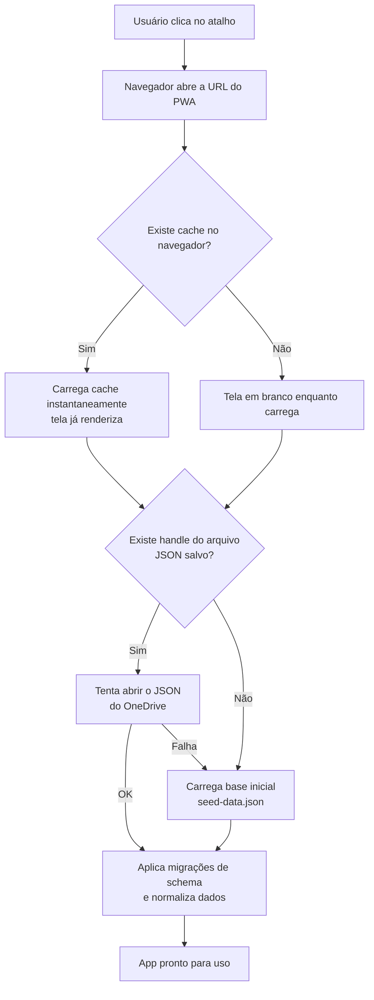
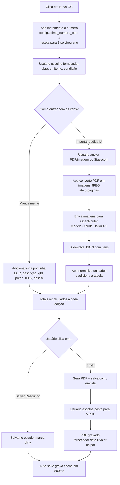
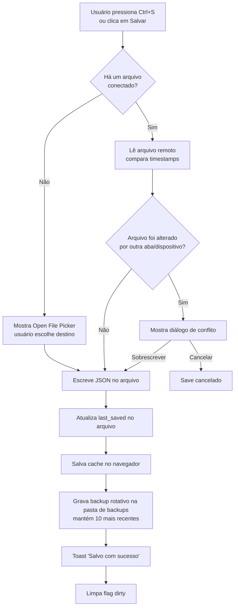

# Fluxo.md — Central de Compras PBQP-H

> Última atualização: 2026-05-06
> Público: dono/operador. Foco em entender o que acontece, sem abrir código.

## O que o sistema faz

A Central de Compras é um aplicativo web (instalável como PWA) que ajuda a Campisi a **criar, controlar e imprimir ordens de compra** dentro do padrão PBQP-H. Você cadastra fornecedores, obras, emitentes (a empresa que assina a OC) e usa o catálogo de 20 categorias ECR para classificar os itens. Cria a OC, digita os itens (ou deixa a IA extrair de um PDF do Sigescom), gera o PDF padrão Campisi e salva tudo num único arquivo JSON na sua pasta do OneDrive. O PDF vai pra pasta da obra; uma cópia rotativa do JSON inteiro vai para uma pasta de backups.

## Diagrama de fluxo principal

### Fluxo 1 — Abrir o app

### Fluxo 2 — Criar uma OC e gerar PDF

### Fluxo 3 — Salvar o JSON no OneDrive

## Fluxo narrado passo a passo

### Passo 1 — Abertura do app

**O que acontece:** Você clica no atalho da Área de Trabalho (`Central de Compras PBQP-H.bat`). Ele abre o navegador na URL do GitHub Pages. O navegador busca os arquivos JS/CSS, monta a tela e dispara a inicialização.

**Responsável:** `index.html` → `src/main.tsx` → `src/App.tsx`.

**O que precisa para funcionar:** conexão de internet (na primeira vez; depois o PWA roda offline) e navegador Chromium (Chrome, Edge, Brave). Firefox/Safari não funcionam por causa da File System Access API.

**O que pode dar errado:** se o Service Worker do PWA está com versão antiga em cache, você pode ver a tela de antes. Solução: `Ctrl+Shift+R` para forçar atualização. Se o navegador for Firefox/Safari, o app abre mas a parte de salvar arquivo não funciona.

---

### Passo 2 — Inicialização dos dados

**O que acontece:** O app tenta três fontes de dados em ordem, da mais rápida para a mais confiável:

1. **Cache do navegador** (localStorage). É instantâneo, mas pode estar desatualizado. Serve para a tela aparecer rápido.
2. **Arquivo JSON do OneDrive** (via File System Access API). É a fonte verdadeira. O app guarda uma "referência" ao arquivo no IndexedDB do navegador, então não precisa pedir para você selecionar de novo.
3. **Base inicial embutida** (`public/seed-data.json`). Só usada na primeira vez de tudo, antes de você ter conectado um arquivo.

A cada fonte carregada, o app aplica **migrações de schema** (transforma estrutura antiga em nova, se necessário) e **normaliza** (preenche campos faltantes com defaults seguros).

**Responsável:** `App.tsx` (linhas 113–150), `services/storage/cache.ts`, `services/storage/fileSystem.ts`, `domain/migrations/index.ts`, `domain/normalize.ts`.

**O que pode dar errado:** se o navegador perdeu permissão para o arquivo (raro, acontece em limpeza de dados de site), o app pede para você reconectar via Configurações → Conectar Arquivo.

---

### Passo 3 — Navegação entre abas

**O que acontece:** Você clica em "Dashboard", "Nova OC", "Histórico", "Fornecedores", etc. O conteúdo muda instantaneamente sem recarregar a página. A aba ativa fica guardada na memória; ao voltar, o estado preserva (filtros, formulários).

**Responsável:** `useUiStore` (Zustand) e o `switch` em `App.tsx` que escolhe qual página renderizar.

**O que pode dar errado:** se você ficar com um formulário aberto (ex: Nova OC com itens digitados) e fechar a aba do navegador sem salvar, o sistema avisa "Tem certeza que sair?" — mas se você confirmar, perde o que digitou (a menos que o auto-save de cache tenha rodado nos últimos 800ms).

---

### Passo 4 — Criar uma Nova OC

**O que acontece:** Você clica em "Nova OC". O sistema **incrementa o contador** (`config.ultimo_numero_oc`) imediatamente — então o número fica reservado mesmo que você não termine a OC. Se virou o ano (janeiro), o contador reseta para 1 automaticamente.

Você preenche:
- **Fornecedor** (dropdown da lista cadastrada)
- **Obra** (dropdown)
- **Emitente** (qual empresa Campisi assina; geralmente só uma)
- **Condição de pagamento** (lista pré-cadastrada)
- **Data**, **observações**

Depois adiciona **itens**, um por linha:
- ECR (categoria do catálogo)
- Descrição, observação
- Quantidade, unidade, preço unitário
- IPI %, Desconto %, prazo de entrega

**Cálculo de cada linha (ordem importa):**
1. Bruto = qtd × preço
2. Desconto = bruto × (desc% / 100)
3. Líquido = bruto − desconto
4. IPI = líquido × (ipi% / 100) ← **IPI aplicado sobre o líquido, não sobre o bruto**
5. Total da linha = líquido + IPI

**Total geral da OC:** soma dos sub-totais − descontos + IPI total + frete + outras despesas − desconto material.

**Responsável:** `features/ordens-compra/NovaOcPage.tsx`, `domain/compute.ts`.

**O que pode dar errado:** se duas pessoas (ou duas abas suas) criam OCs ao mesmo tempo, o número pode duplicar. Não há trava de servidor — é o preço de não ter backend. Como mitigação, o sistema **re-verifica** o número no momento de salvar/emitir: se já existe outra OC com o mesmo número, ele reatribui automaticamente para o próximo livre e avisa via toast. Para single-user é raro acontecer.

---

### Passo 5 — Importar pedido via IA (opcional)

**O que acontece:** Em vez de digitar os itens manualmente, você clica em "Importar Pedido" e anexa um PDF ou imagem do pedido do Sigescom. O sistema:

1. Converte o PDF em imagens JPEG (até 5 páginas).
2. Envia as imagens para o OpenRouter (serviço que dá acesso a vários modelos de IA).
3. O modelo `anthropic/claude-haiku-4.5` lê as imagens e devolve um JSON com os itens.
4. O app normaliza as unidades ("saco" → "sc", "unid" → "un") e adiciona à tabela.

**Responsável:** `services/ai/pdfToImages.ts`, `services/ai/openRouterClient.ts`, `services/ai/extractItems.ts`.

**O que precisa funcionar:** Chave de API do OpenRouter cadastrada em Configurações → "Chave OpenRouter". Conexão de internet.

**O que pode dar errado:**
- Sem chave configurada → erro.
- PDF com mais de 5 páginas → só as 5 primeiras viram imagem.
- IA confusa com layout (descrições erradas, unidade não mapeada) → você revisa manualmente antes de emitir.
- Cota do OpenRouter esgotada → erro 429.

---

### Passo 6 — Gerar e salvar o PDF da OC

**O que acontece:** Você clica em "Emitir". O sistema:

1. Marca a OC como `emitida` e timestamp `pdf_gerado_em`.
2. Monta o PDF no padrão Campisi: cabeçalho, dados de faturamento, condição de pagamento, fornecedor, endereço de entrega, tabela de itens, totalizadores, textos de qualidade/contratação.
3. Sugere o nome `{fornecedor} {data} R{valor} oc.pdf` e abre o seletor para você escolher onde salvar (idealmente a pasta da obra).

**Responsável:** `services/pdf/generateOcPdf.ts`, `services/pdf/pdfFilename.ts`.

**O que pode dar errado:** se você cancelar o seletor de salvar, o PDF não é gerado mas a OC fica como `emitida` no histórico. Você pode regenerar depois pelo Histórico → Regenerar PDF.

---

### Passo 7 — Salvar o JSON no OneDrive

**O que acontece:** Pressionar **Ctrl+S** (ou clicar em Salvar) dispara o ciclo de persistência.

1. **Verificação de conflito:** O app lê o `last_saved` do arquivo no OneDrive e compara com o último que ele conhecia. Se outro dispositivo/aba salvou enquanto você editava, ele mostra um diálogo de conflito.
2. **Escrita:** Atualiza `last_saved = agora` no payload, abre o arquivo para escrita, grava o JSON inteiro.
3. **Cache:** Atualiza o snapshot localStorage para boot rápido.
4. **Backup rotativo:** Se você configurou uma pasta de backups, grava `central-compras-data-{timestamp}.json` lá. Mantém apenas os 10 mais recentes (FIFO).
5. **Toast** "Salvo com sucesso" e limpa a marca de "alterações não salvas".

**Responsável:** `services/storage/fileSystem.ts#saveData`, `services/storage/concurrency.ts`, `services/storage/backups.ts`.

**O que pode dar errado:**
- **Conflito** → aparece o diálogo perguntando se quer sobrescrever ou cancelar. Sobrescrever apaga as edições da outra aba/dispositivo.
- **Permissão revogada** → o app pede para você selecionar o arquivo de novo (`showSaveFilePicker`).
- **Sem suporte (Firefox/Safari)** → último recurso é fazer download do arquivo e você substitui manualmente no OneDrive.
- **Pasta de backups inacessível** → falha silenciosa; o save principal não é interrompido.

---

### Passo 8 — Auto-save em segundo plano

**O que acontece:** Cada vez que você edita qualquer coisa (digitar em um campo, adicionar item, mudar status, etc.), 800ms depois o app grava um snapshot no localStorage do navegador. **Isso não escreve no arquivo do OneDrive** — só serve para o caso de a aba fechar acidentalmente.

**Responsável:** `hooks/useAutoSave.ts`, `services/storage/cache.ts`.

**O que pode dar errado:** localStorage pode encher (raro, ~10MB de limite). Sem alerta — silencia o erro.

---

## Pontos de decisão

| Onde | Decisão | Com base em quê | Caminhos |
|---|---|---|---|
| Inicialização | Qual fonte de dados usar? | cache existe? handle existe? handle responde? | cache → handle → seed |
| Nova OC | Qual número usar? | `currentYear === config.ano_corrente`? | mantém sequencial e incrementa / reseta para 1 |
| Salvar OC | Status final? | botão clicado | "Salvar Rascunho" → `rascunho` / "Emitir" → `emitida` (gera PDF) |
| Save JSON | Conflito remoto? | `remote.last_saved > knownSavedAt`? | continua e sobrescreve / abre diálogo |
| Save JSON | Como escrever? | tem handle? tem permissão? | write direto / showSaveFilePicker / download |
| Importar IA | Tipo de arquivo? | mime type | imagem direto / PDF → render páginas |
| Histórico | Quais ações disponíveis? | status atual da OC | rascunho: editar+excluir; emitida: regerar+entregue+cancelar; entregue/cancelada: só duplicar |
| Emitente do PDF | Qual emitente exibir? | `oc.emitente_id` preenchido? | usa esse / `config.emitentes[0]` / legado `config.emitente` |

## Estados intermediários

### O JSON principal (`central-compras-data.json`)
1. Nasce em `public/seed-data.json` (primeira vez) ou no OneDrive (sessões seguintes).
2. Lido → migrado (v1→v2→v3) → normalizado → vira o estado em memória.
3. Editado pelo usuário (Zustand `useDataStore`).
4. Auto-save grava snapshot em **localStorage** (cache rápido).
5. Save explícito grava no **arquivo do OneDrive** + atualiza cache + grava backup.
6. Backup vai para pasta separada (`central-compras-data-{timestamp}.json`, mantém 10).

### Uma OC em edição
1. Botão "Nova OC" → cria objeto novo com número incrementado e `status='rascunho'`.
2. Vai para `useOcEditingStore` (clone isolado, não toca no array de OCs ainda).
3. Usuário edita → cálculos são recomputados a cada mudança.
4. "Salvar Rascunho" → `useDataStore.updateOrdemCompra()` faz upsert no array; `dirty=true`.
5. "Emitir" → mesmo upsert + status='emitida' + `pdf_gerado_em` + abre seletor de PDF.
6. Auto-save grava cache.
7. Você aperta Ctrl+S → grava no JSON do OneDrive.

### O PDF da OC
1. Construído em memória pelo jsPDF a partir da OC + dados (fornecedor, obra, emitente).
2. Vira Blob.
3. Sugere nome `{slug fornecedor} {data} R{valor} oc.pdf`.
4. Você escolhe a pasta da obra, ele grava lá.
5. Não fica armazenado dentro do JSON — só o `pdf_gerado_em` registra que foi gerado.

## Pontos de manutenção frequente

### 1. Mudar o layout do PDF (mais comum)
**O que muda:** posições de campos, novos textos fixos, tamanho de fonte.
**Onde:** `src/services/pdf/generateOcPdf.ts`. Layout é em milímetros (A4 = 210×297 mm). Função tem helpers `drawBox`, `addrLine`. Texto fixo de qualidade/contratação vem de `config.texto_qualidade`, `config.texto_contratacao` — esses são editáveis pela aba Configurações sem mexer no código.

### 2. Adicionar nova condição de pagamento ou texto padrão
**Onde:** **Não no código.** Aba Configurações → "Condições de Pagamento" (chips) ou "Textos customizáveis". Salva no JSON como parte do `config`.

### 3. Cadastrar/editar fornecedores, obras, emitentes
**Onde:** **Não no código.** Abas correspondentes. CRUD via drawer.

### 4. Trocar o modelo de IA ou API key
**Onde da chave:** Configurações → "Chave OpenRouter".
**Onde do modelo:** `src/services/ai/openRouterClient.ts` → constante `MODEL`. Hoje em `anthropic/claude-haiku-4.5`. Trocar por outro modelo do OpenRouter pode exigir ajuste em `MAX_TOKENS` e revisão do prompt em `extractItems.ts`.

### 5. Adicionar novo ECR ou alterar campos existentes
**Onde dos materiais cadastráveis:** aba Catálogo ECR (UI).
**Onde dos 20 ECRs em si:** estão no `seed-data.json`. Para alterar normas/objetivo/escopo de um ECR existente nas instalações antigas, é uma migração de schema (`v3-to-v4.ts`).

### 6. Mudar URL de produção / nome do repositório
**Onde:** três lugares precisam casar:
- `vite.config.ts` → constante `base` (subpath do GH Pages).
- `start.bat` (atalho da Área de Trabalho) → URL hardcoded.
- `.github/workflows/deploy.yml` → workflow de deploy do GH Actions.

## Avisos importantes

- **IPI sobre líquido, não sobre bruto.** Difere de muitos ERPs. Se mudar essa regra, é um cálculo central.
- **Sem trava de concorrência de servidor.** Duas abas/dispositivos podem editar ao mesmo tempo. Há duas mitigações: (1) o número da OC é re-verificado no momento de salvar/emitir e reatribuído se já estiver em uso (com toast); (2) no save do JSON, o sistema lê o `last_saved` remoto e exibe diálogo de conflito. Mesmo assim, para uso single-user é o cenário recomendado.
- **Backups dependem de você ter escolhido a pasta** em Configurações. Se não escolheu, simplesmente não há backup. A aba Configurações agora exibe um aviso amarelo explícito enquanto a pasta não estiver definida — configure logo no primeiro uso.
- **Auto-save NÃO escreve no OneDrive.** Só guarda no navegador (localStorage). Se você fechar o navegador limpando dados de site, perde o que não salvou explicitamente. Persistência só ocorre via Ctrl+S / botão Salvar.
- **Chave OpenRouter fica em texto puro** no JSON local. O input já mascara como senha e bloqueia gerenciadores de senha, mas trate o arquivo (e os backups rotativos) como dado sensível.
- **PDF worker path fixo** — a importação de pedidos via IA depende do worker do `pdfjs-dist` em `/assets/pdfjs/`. Não altere `assetsDir` do Vite sem testar essa funcionalidade.
- **Após push para o GitHub, o deploy demora ~1 minuto** e depois ainda pode ter cache do PWA (Service Worker). Sempre `Ctrl+Shift+R` para garantir.
- **Firefox e Safari não suportam File System Access API.** Use Chrome, Edge ou Brave.
